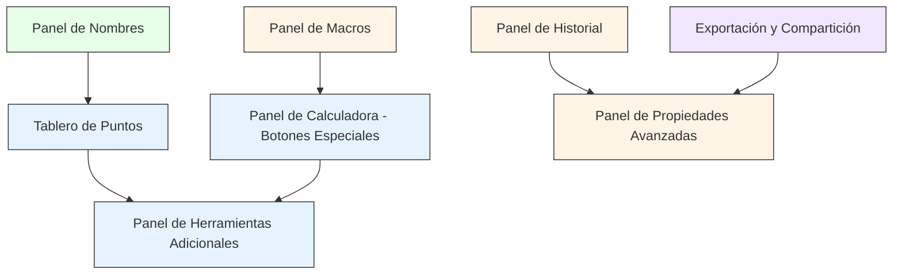

# Requisitos de Continuación de Migración Angular: DGPad

## Introducción

Este documento establece los requisitos para continuar la migración progresiva de DGPad de JavaScript legacy a Angular 19. La aplicación ya cuenta con una migración parcial significativa: toolbar, panel de propiedades, panel de widgets, panel de macros, panel de calculadora y panel de nombres. Pendiente inmediato según CODEX_CONTINUIDAD.md: probar calculadora, revisar botones especiales de la calculadora (conversión a punto/lista/función), y resolver el problema del "Tablero de puntos" donde los objetos parecen crearse y desaparecer inmediatamente.

## Glossario

- **DGPad**: Sistema de geometría dinámica legacy ejecutándose en iframe
- **Angular**: Framework frontend para la nueva implementación
- **DgpadBridgeService**: Servicio unificado de comunicación entre Angular y DGPad legacy
- **Iframe**: Contenedor del DGPad legacy en `#dgpad-legacy-frame`
- **Panel Flotante**: Componente Angular que replica funcionalidad legacy en la UI moderna
- **Tablero de Puntos**: Feature de crear múltiples puntos rápidamente con nombre automático
- **Botones Especiales de Calculadora**: Funciones que convierten expresiones a puntos, listas o funciones
- **Migración Incremental**: Estrategia de migrar feature por feature manteniendo compatibilidad total

## Features Críticas Pendientes

### Feature 1: Panel de Calculadora - Botones Especiales

**User Story:** Como usuario, quiero usar los botones especiales de la calculadora para convertir expresiones en objetos geométricos dinámicos, como puntos, listas o funciones, sin tener que escribir código legacy manualmente.

#### Contexto

El panel de calculadora ya está parcialmente migrado, pero faltan implementar botones especiales que permiten:
- **Conversión a punto**: Convertir una expresión en un objeto PointObject con nombre automático
- **Conversión a lista**: Convertir una expresión en un ListObject para operaciones con colecciones
- **Conversión a función**: Crear un objeto FunctionObject a partir de una expresión matemática

#### Acceptance Criteria

1. WHEN el usuario presiona un botón especial de conversión en el panel de calculadora Angular, THE System SHALL ejecutar la operación correspondiente en DGPad legacy a través del bridge
2. WHILE el panel de calculadora esté abierto, THE System SHALL mantener la sincronización entre el estado Angular y el estado legacy
3. WHEN una expresión se convierte a punto, THE System SHALL crear un PointObject con nombre automático único y posicionamiento en centro del canvas
4. WHEN una expresión se convierte a lista, THE System SHALL crear un ListObject que referencie la expresión original
5. WHEN una expresión se convierte a función, THE System SHALL crear un FunctionObject visible en el canvas
6. IF el sistema de nombres de DGPad no está disponible, THE System SHALL mostrar mensaje de error y no crear el objeto
7. WHERE múltiples conversiones se ejecuten rápidamente, THE System SHALL procesarlas secuencialmente sin corregir resultados

#### Dependencies

- Panel de calculadora Angular funcional (migración actual)
- DgpadBridgeService con métodos para crear objetos legacy
- Validación de expresiones válidas en DGPad legacy

---

### Feature 2: Tablero de Puntos (Board Points)

**User Story:** Como usuario, quiero crear múltiples puntos rápidamente con nombre automático, para acelerar el trabajo en construcciones complejas que requieren muchos puntos.

#### Contexto

Según CODEX_CONTINUIDAD.md, existe un problema donde "los objetos parecen crearse y desaparecer inmediatamente" en el Tablero de puntos. Esto indica un problema de renderizado, sincronización de estado, o limpieza prematura de objetos.

#### Acceptance Criteria

1. WHEN el usuario activa el panel de Tablero de Puntos, THE System SHALL mostrar una interfaz para crear puntos múltiples con nombres automáticos
2. WHEN el usuario especifica un rango de puntos (número inicial y final), THE System SHALL crear los objetos PointObject correspondientes en DGPad legacy
3. WHILE el panel de Tablero de Puntos esté activo, THE System SHALL mantener los puntos creados visibles y editables en el canvas
4. WHEN un punto se crea, THE System SHALL asignar automáticamente un nombre único basado en patrón configurable (ej: A, B, C... o P1, P2, P3...)
5. IF el canvas no está listo o $CANVAS no está disponible, THE System SHALL mostrar mensaje de espera y reintentar automáticamente
6. WHEN múltiples puntos se crean secuencialmente, THE System SHALL garantizar que cada punto permanezca visible después de la creación del siguiente
7. WHERE el usuario cancela la operación de creación, THE System SHALL limpiar puntos parciales y restaurar estado anterior

#### Dependencies

- Panel de Tablero de Puntos Angular
- Implementación de bridge method `createBoardPoints()`
- Resolución de sincronización de renderizado entre Angular y legacy
- Manejo de lifecycle de objetos en canvas

---

### Feature 3: Panel de Herramientas Adicionales (Other Tools)

**User Story:** Como usuario, quiero acceder a herramientas adicionales desde el menú de herramientas, para realizar operaciones avanzadas sin salir de la interfaz principal.

#### Contexto

Existe un componente `other-tools-menu` pero necesita evaluación completa de funcionalidad pendiente. Probablemente incluye: BlocklyButton, Expression, Expression Points, Expression Segments, Integer Cursor, Continuous Cursor, Edit Widget, Clear Construction, Undo/Redo.

#### Acceptance Criteria

1. WHEN el usuario hace clic en el menú de Herramientas Adicionales, THE System SHALL mostrar una lista de herramientas disponibles
2. WHEN el usuario selecciona Blockly Button, THE System SHALL crear un objeto BlocklyButton con diálogo de nombre y posicionamiento automático
3. WHEN el usuario selecciona Expression, THE System SHALL crear un objeto Expression con expresión por defecto y posicionamiento automático
4. WHEN el usuario selecciona Expression Points, THE System SHALL crear una expresión con coordenadas de rectángulo áureo y una lista referenciándola con segmentos desactivados
5. WHEN el usuario selecciona Expression Segments, THE System SHALL crear una expresión con coordenadas de rectángulo áureo y una lista referenciándola con segmentos activados
6. WHEN el usuario selecciona Integer Cursor, THE System SHALL crear un objeto Expression con rango 0-10 e incremento 1
7. WHEN el usuario selecciona Continuous Cursor, THE System SHALL crear un objeto Expression con rango -10 a 10 sin incremento fijo
8. WHEN el usuario selecciona Edit Widget, THE System SHALL crear un widget editable con input y textarea para referenciar otros objetos
9. WHEN el usuario selecciona Clear Construction, THE System SHALL eliminar todos los objetos de la construcción actual y repintar el canvas
10. WHEN el usuario selecciona Undo, THE System SHALL deshacer la última acción en DGPad legacy
11. WHEN el usuario selecciona Redo, THE System SHALL rehacer la última acción deshecha en DGPad legacy
12. WHERE múltiples herramientas se ejecuten en secuencia, THE System SHALL mantener el estado consistente entre operaciones
13. IF una herramienta requiere objetos existentes y no hay suficientes, THE System SHALL mostrar mensaje de error específico con objetos requeridos

#### Dependencies

- Panel OtherToolsMenuComponent Angular implementado
- Bridge methods para cada herramienta legacy
- Validación de prerequisites para cada herramienta
- Manejo de errores específico por herramienta

---

### Feature 4: Panel de Historial

**User Story:** Como usuario, quiero navegar por el historial de mi construcción, para recuperar estados anteriores o revisar la evolución de mi trabajo.

#### Contexto

Existe un componente `history-dialog` que requiere integración completa. DGPad legacy tiene soporte nativo para history snapshots con fecha, imagen, y lock status.

#### Acceptance Criteria

1. WHEN el usuario abre el panel de Historial, THE System SHALL cargar y mostrar todas las snapshots disponibles desde DGPad legacy
2. WHEN el usuario selecciona una snapshot, THE System SHALL restaurar el estado de DGPad a ese momento exacto
3. WHILE el usuario navega entre snapshots, THE System SHALL mostrar imagen previa y fecha de cada snapshot
4. WHEN el usuario hace clic en "Guardar Snapshot", THE System SHALL crear un nuevo snapshot en DGPad legacy con timestamp actual
5. WHEN el usuario hace clic en "Limpiar Historial Desbloqueado", THE System SHALL eliminar todos los snapshots que no estén marcados como lock: true
6. WHERE múltiples usuarios trabajan en la misma construcción, THE System SHALL mantener historial independiente por sesión
7. IF el usuario intenta guardar snapshot cuando el canvas no está renderizado, THE System SHALL mostrar advertencia y permitir retry

#### Dependencies

- Panel HistoryDialogComponent Angular
- Bridge methods: `getHistoryEntries()`, `saveHistorySnapshot()`, `openHistoryEntry()`, `clearUnlockedHistory()`
- Visualización de snapshots con thumbs
- Manejo de estado de navegación

---

### Feature 5: Panel de Propiedades Avanzadas

**User Story:** Como usuario avanzado, quiero acceder a propiedades avanzadas de objetos geométricos, para ajustar comportamiento específico que no está disponible en la interfaz básica.

#### Contexto

Panel de propiedades está migrado para propiedades globales, puntos, ángulos, ejes/cuadrícula y otros objetos, pero requiere validación de propiedades avanzadas: precision, increment, shape, dash, noMouse, track, angle360, exclusive, layer, etc.

#### Acceptance Criteria

1. WHEN el usuario selecciona un objeto geométrico, THE System SHALL mostrar todas las propiedades editables disponibles en el panel de propiedades Angular
2. WHILE el usuario modifica cualquier propiedad avanzada, THE System SHALL actualizar inmediatamente el objeto en el canvas y mantener sincronización bidireccional
3. WHEN el usuario activa "Apply to All", THE System SHALL aplicar la propiedad modificada a todos los objetos del mismo tipo
4. WHERE una propiedad requiere valor numérico con rango específico (ej: opacity 0-1, precision 0-10), THE System SHALL validar input y mostrar help text
5. IF el usuario intenta aplicar propiedad a objeto que no la soporta, THE System SHALL mostrar mensaje de error y no aplicar cambio
6. WHEN el usuario cambia entre modos de visualización (degrees/radians, grid visible), THE System SHALL actualizar el canvas inmediatamente
7. WHERE múltiples objetos se seleccionan y se modifica una propiedad compartida, THE System SHALL aplicar cambio a todos los objetos seleccionados

#### Dependencies

- Panel PropertiesPanelComponent Angular
- Bridge methods para todas las propiedades
- Validación de compatibilidad de propiedades por tipo de objeto
- UI para multi-selección y "Apply to All"

---

### Feature 6: Panel de Macros

**User Story:** Como usuario avanzado, quiero crear y ejecutar macros personalizadas, para automatizar secuencias complejas de construcciones geométricas.

#### Contexto

Panel de macros está parcialmente migrado. Requiere validación de: catálogo de plugins/tools, draft de macros, prompts de parámetros y ejecución completa.

#### Acceptance Criteria

1. WHEN el usuario abre el panel de Macros, THE System SHALL cargar y mostrar catálogo completo de macros disponibles en DGPad legacy (plugins y tools)
2. WHEN el usuario selecciona una macro del catálogo, THE System SHALL mostrar detalles: nombre, número de parámetros, tipo de objetos requeridos
3. WHEN el usuario ejecuta una macro, THE System SHALL mostrar prompts interactivos para cada parámetro requerido
4. WHILE el usuario completa los prompts de una macro, THE System SHALL mantener el estado de ejecución y validar inputs
5. WHEN el usuario confirma una macro, THE System SHALL ejecutar la macro en DGPad legacy y mostrar resultados
6. WHEN el usuario crea un draft de macro, THE System SHALL guardar estado actual de parámetros y targets para continuar después
7. WHERE el usuario continua un draft guardado, THE System SHALL restaurar todos los parámetros y targets previamente definidos
8. IF una macro requiere objetos que no existen en el canvas, THE System SHALL mostrar mensaje de error específico con lista de objetos faltantes

#### Dependencies

- Panel MacroPanelComponent Angular
- Bridge methods: `getMacroCatalog()`, `startMacro()`, `getActiveMacro()`, `getMacroDraft()`, `saveMacroDraft()`
- UI para prompts interactivos de parámetros
- Gestión de estado de draft

---

### Feature 7: Panel de Nombres

**User Story:** Como usuario, quiero gestionar los nombres de mis objetos geométricos de forma centralizada, para evitar conflictos y mantener una nomenclatura consistente.

#### Contexto

Panel de nombres está parcialmente migrado. Requiere validación de: visibilidad, auto-naming, y sincronización con creación de objetos.

#### Acceptance Criteria

1. WHEN el usuario activa el panel de Nombres, THE System SHALL mostrar lista de todos los objetos existentes con sus nombres actuales
2. WHEN el usuario edita un nombre en el panel, THE System SHALL actualizar el nombre del objeto en DGPad legacy y repintar el canvas
3. WHEN un objeto se crea sin nombre asignado y el panel de Nombres está visible, THE System SHALL mostrar automáticamente diálogo de asignación de nombre
4. WHERE el usuario intenta asignar un nombre que ya existe, THE System SHALL mostrar advertencia y sugerir nombre alternativo
5. WHEN el usuario cierra el panel de Nombres, THE System SHALL mantener visibles los nombres de objetos según preferencia de DGPad
6. IF el sistema de nombres de DGPad no está disponible, THE System SHALL mostrar mensaje de error y permitir retry

#### Dependencies

- Panel NamesPanelComponent Angular
- Bridge methods: `openNames()`, `closeNames()`, `isNamesVisible()`
- Listener para eventos de creación de objetos en legacy
- UI para editar nombres inline

---

### Feature 8: Exportación y Compartición

**User Story:** Como usuario, quiero exportar mis construcciones en múltiples formatos, para compartirlas en diferentes contextos (web, documentación, impresión).

#### Contexto

DGPad legacy tiene soporte para exportación en text, HTML+JS, HTML, Responsive HTML, SVG, PNG. Requiere integración con Angular para UI y gestión de opciones.

#### Acceptance Criteria

1. WHEN el usuario selecciona Exportar Texto, THE System SHALL generar y descargar archivo .txt con código legible de la construcción
2. WHEN el usuario selecciona Exportar HTML+JS, THE System SHALL generar y descargar archivo .html con código completo ejecutable
3. WHEN el usuario selecciona Exportar HTML, THE System SHALL generar y descargar archivo .html simplificado sin JavaScript adicional
4. WHEN el usuario selecciona Exportar HTML Responsive, THE System SHALL generar y descargar archivo .html optimizado para dispositivos móviles
5. WHEN el usuario selecciona Exportar SVG, THE System SHALL generar y descargar archivo .svg con vectorial de la construcción actual
6. WHEN el usuario selecciona Exportar PNG, THE System SHALL generar y descargar archivo .png con renderizado de la construcción actual
7. WHERE el usuario puede configurar opciones de exportación (fix widgets, fix scripts, hide panel, disable zoom), THE System SHALL permitir selección antes de generar exportación
8. IF la exportación falla o DGPad no devuelve contenido, THE System SHALL mostrar mensaje de error y permitir retry

#### Dependencies

- UI Angular para selección de formato y opciones
- Bridge methods: `exportText()`, `exportHtmlJs()`, `exportHtml()`, `exportResponsive()`, `exportSvg()`, `exportPng()`
- Gesti��n de descargas de archivos en navegador
- UI de progress y feedback

---

## Mejoras de Calidad

### Testing y Validación

#### Unit Testing Requirements

1. **Bridge Service**: Cubrir 90%+ de coverage con tests para todos los métodos
2. **Componentes**: Cubrir 80%+ de coverage con tests para componentes migrados
3. **Features críticas**: Tests específicos para botones especiales de calculadora, Tablero de Puntos, y Herramientas Adicionales

#### Integration Testing Requirements

1. **End-to-end bridge**: Probar flujo completo Componente → Bridge → iframe → Legacy
2. **Sincronización de estado**: Verificar que estado Angular y legacy siempre estén sincronizados
3. **Manejo de errores**: Probar todos los casos de error definidos en acceptance criteria
4. **Timing**: Verificar que operaciones asíncronas respeten deadlines razonables (< 500ms)

#### Manual Testing Requirements

1. **Probar en navegador**: Cada feature migrada debe probarse en Chrome
2. **Verificar no hay errors de consola**: Revisar que no haya warnings o exceptions
3. **Probar operaciones básicas**: Crear, mover, editar, eliminar objetos
4. **Verificar exportación**: Probar todos los formatos de exportación

---

### Performance Requirements

1. **First Contentful Paint**: < 1 segundo para carga inicial
2. **Time to Interactive**: < 3 segundos para estado interactivo
3. **Memory**: < 100MB en uso normal
4. **Canvas Paint**: Smooth animation sin lag (> 30fps)
5. **Event Listeners**: Limpiar correctamente en destroy de componentes
6. **Iframe Loading**: < 2 segundos para carga de iframe legacy

---

### UX Requirements

1. **Feedback inmediato**: Todas las operaciones deben mostrar feedback visual inmediato (< 200ms)
2. **Error messages claros**: Mensajes específicos con acción para resolver
3. **Consistencia**: Mismos patrones UI en todos los componentes migrados
4. **Accesibilidad**: Cumplir WCAG 2.1 AA para componentes críticos
5. **Responsive**: Panel de herramientas debe funcionar en desktop y tablet

---

## Criterios de Éxito

### Criterios Técnicos

1. **Coverage mínimo**: 80% coverage en componentes Angular y 90% en bridge service
2. **Cero errors de consola**: No hay exceptions ni warnings en navegadores soportados
3. **Sin memory leaks**: Event listeners se limpian correctamente, no hay acumulación de memory
4. **Performance aceptable**: Tiempos de respuesta < 500ms para operaciones síncronas
5. **Compatible con Chrome**: Funciona correctamente en última versión estable de Chrome

---

### Criterios Funcionales

1. **Todas las features críticas implementadas**: Tablero de Puntos, Botones Especiales, Herramientas Adicionales
2. **Flujo completo funcional**: Usuario puede crear, editar, exportar, y compartir construcciones
3. **Sincronización perfecta**: Estado Angular y legacy siempre concuerdan
4. **Sin regresiones**: Funcionalidad legacy original sigue funcionando sin cambios

---

### Criterios de Qualidad de Código

1. **Sigue patrón de puente**: Todos los componentes usan DgpadBridgeService, no acceso directo a iframe
2. **Tipos TypeScript**: Todo el código tiene tipos definidos, no `any` no tipado
3. **Tests automatizados**: Tests unitarios e integration tests pasando
4. **Documentation**: Código comentado, JSDoc en métodos públicos
5. **Style guide**: Sigue Angular Style Guide y convenciones del proyecto

---

### Criterios de Entrega

1. **Code review aprobado**: Revisión por al menos 2 desarrolladores senior
2. **CI/CD passing**: Build y tests en CI/CD pipeline sin fallos
3. **User acceptance testing**: Feedback positivo de usuarios beta
4. **Documentation actualizada**: Manual de usuario y developer guide al día

---

## Dependencias entre Features

### Priorización Recomendada

**Fase 1 - Críticas (Bloqueantes):**
1. Tablero de Puntos - Resuelve issue inmediato de "objetos desapareciendo"
2. Panel de Herramientas Adicionales - Herramientas clave (Undo/Redo, Clear Construction)

**Fase 2 - Importantes (User Impact):**
3. Panel de Calculadora - Botones especiales para conversión a punto/lista/función
4. Panel de Propiedades Avanzadas - Funcionalidad completa de editación

**Fase 3 - Deseables (Enhancement):**
5. Panel de Historial - Navegación por estados anteriores
6. Panel de Macros - Automatización de secuencias complejas
7. Panel de Nombres - Gestion centralizado de nomenclatura
8. Exportación y Compartición - Múltiples formatos para distribución

---

## Requisitos No Funcionales

### Seguridad

1. **Validación de iframe**: Verificar iframe cargado antes de acceder a bridge
2. **Origin validation**: Solo aceptar postMessage del mismo origin
3. **XSS protection**: Sanitizar todos los inputs antes de ejecutar en legacy
4. **Error handling**: No exponer stack traces sensibles al usuario

---

### Mantenibilidad

1. **Código modular**: Componentes reutilizables, services especializados
2. **Testing first**: Escribir tests antes de implementar features nuevas
3. **Refactoring periódico**: Revisar código legacy y bridge cada 2 sprints
4. **Documentation**: Actualizar文档 cada vez que se modifique API pública

---

### Escalabilidad

1. **State management**: Usar NgRx o Signals para estado complejo
2. **Lazy loading**: Cargar features en modulos separados
3. **Code splitting**: Dividir bundles por feature module
4. **Caching**: Cache resultados costosos de legacy cuando sea posible

---

## Referencias

- [CODEX_CONTINUIDAD.md](./CODEX_CONTINUIDAD.md) - Estado actual de migración
- [DgpadBridgeService](./src/app/core/dgpad-bridge/dgpad-bridge.service.ts) - Puente de comunicación
- [DGPad Legacy Code](./public/dgpad-legacy/) - Código fuente legacy
- [Angular Migration Guide](https://angular.io/guide/migration) - Guía oficial de migración
- [Testing Guidelines](./.kiro/steering/testing-guidelines.md) - Estándares de testing